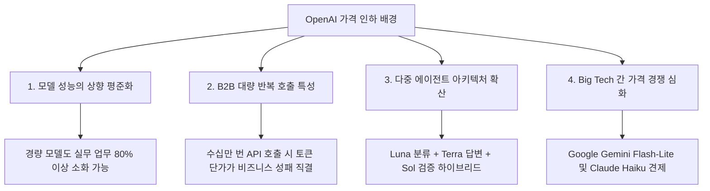

# [심층 분석 보고서] GPT-5.6 API 대규모 가격 인하와 AI 모델 시장의 패러다임 변화

> **작성일자**: 2026년 8월  
> **출처 및 원문 분석**: 위키독스 IT 인사이트 (@yuncastle, [원문 링크](https://wikidocs.net/blog/@yuncastle/27372/))  
> **분류**: AI 인프라 전략 / LLM 토큰 비용 분석 / AX 비즈니스 로드맵

---

## Executive Summary (경영진 요약)

1. **사건 개요**: OpenAI가 GPT-5.6 출시 약 3주 만인 2026년 7월 30일부로 **경량 모델인 GPT-5.6 Luna의 API 단가를 80% 대폭 인하**하고, **균형형 모델인 GPT-5.6 Terra를 20% 인하**함 (최상위 플래그십 Sol은 동결).
2. **시장 패러다임 전환**: AI 모델 경쟁의 축이 단순 "누가 가장 높은 벤치마크 점수를 기록했는가"에서 **"동일 비용으로 실제 업무를 얼마나 많이 안정적으로 완료할 수 있는가(Performance per Dollar)"**로 완전히 이동함.
3. **핵심 시사점 및 기업 대응 전략**:
   - 모든 업무에 비싼 플래그십 모델을 사용하는 것은 비효율적이며, **'지능형 하이브리드 라우팅(Hybrid Routing)'**을 통해 단순 반복 업무(80%+)는 Luna/Terra에 배정하고 고난도 검증(10~20%)만 Sol에 배정하는 아키텍처 도입이 시급함.
   - 경쟁사(Google Gemini Flash-Lite, Anthropic Claude Haiku)와의 대량 처리 단가 경쟁에서 OpenAI가 가장 공격적인 가격표($0.20 / $1.20)를 제시함.

---

## 1. GPT-5.6 제품군 가격 인하 상세 내역

OpenAI는 GPT-5.6을 세대(Generation)로 정의하고, 활용 목적과 성능에 따라 **Sol(최상위), Terra(균형형), Luna(경량형)** 3대 티어로 세분화하였습니다.

### 📊 100만 토큰(1M Tokens) 기준 단가 변동표

| 모델 등급 | 포지셔닝 | 입력 단가 (기존 → 변경) | 출력 단가 (기존 → 변경) | 인하율 | 핵심 특징 및 적합 업무 |
| :--- | :--- | :---: | :---: | :---: | :--- |
| **GPT-5.6 Sol** | 최상위 플래그십 | **$5.00** (동결) | **$30.00** (동결) | **0%** | 복합 논리 추론, 심층 디버깅, 법률/보안/과학 분석, 장시간 에이전트 |
| **GPT-5.6 Terra** | 성능/비용 균형형 | $2.50 → **$2.00** | $15.00 → **$12.00** | **▼ 20%** | 마케팅 콘텐츠 작성, 일반 코딩, 고객 챗봇, 사내 업무 자동화 |
| **GPT-5.6 Luna** | 초고속/초저비용 경량형 | $1.00 → **$0.20** | $6.00 → **$1.20** | **▼ 80%** | 문장 분류, 태그 생성, 단문 요약, 대량 번역, 실시간 에이전트 루프 |

> ※ 100만 토큰은 일반적인 텍스트 기준 영문 약 75만 단어, 한글 약 60만 자에 해당합니다.

---

## 2. 기업 및 실무 관점의 비용 절감 체감 분석

기업 서비스 운영 시 일반적인 월간 사용량(입력 1,000만 토큰 / 출력 200만 토큰)을 가정한 비용 시뮬레이션입니다.

```text
[월간 1,200만 토큰 처리 시나리오]
┌──────────────────┬─────────────────┬─────────────────┬──────────────────┐
│ 모델             │ 기존 월 청구액   │ 변경 후 월 청구액│ 실제 절감액      │
├──────────────────┼─────────────────┼─────────────────┼──────────────────┤
│ GPT-5.6 Luna     │ $22.00          │ $4.40           │ $17.60 (▼80.0%)  │
│ GPT-5.6 Terra    │ $55.00          │ $44.00          │ $11.00 (▼20.0%)  │
└──────────────────┴─────────────────┴─────────────────┴──────────────────┘
```

- **대규모 트래픽 기업**: 월 10억 토큰을 소모하는 대규모 고객 센터나 AI 서비스의 경우, Luna 도입 시 **월 $2,200에서 $440로 낮아져 연간 수천만 원 이상의 순수 인프라 비용 절감** 효과 발생.
- **ChatGPT 일반 구독자와의 차이**: 일반 개인 사용자가 결제하는 ChatGPT Plus/Pro 월 구독료는 변동이 없으며, 기업 및 개발자가 사용하는 **API 호출 및 ChatGPT Work/Codex 크레딧 소모량**에서 직접적인 비용 절감 혜택이 적용됨.

---

## 3. OpenAI의 파격적 가격 인하 배경 (4대 요인)



1. **AI 모델 성능의 상향 평준화**:
   - 과거에는 최신 플래그십 모델만 의미 있는 성과를 냈으나, 현재는 경량/중간 모델(Luna/Terra)도 일상적인 글쓰기, 번역, 요약, 데이터 추출을 충분히 정확하게 처리합니다.
2. **실제 서비스의 대량 반복 호출 환경**:
   - 쇼핑몰 상품 카테고리 태깅, 고객 문의 1차 필터링 등 수십만 회씩 호출되는 기능에서는 소수점 단위의 토큰 단가가 서비스 마진을 좌우합니다.
3. **'다중 에이전트(Multi-Agent)' 협업 구조의 보편화**:
   - 모든 과정을 최고가 모델 하나로 처리하는 대신, 1차 분류는 Luna, 본문 작성은 Terra, 최종 검수만 Sol에 맡기는 '비용 최적화 파이프라인' 구축이 대세가 되었습니다.
4. **빅테크 생태계 락인(Lock-in) 경쟁**:
   - Google과 Anthropic이 공격적인 경량 모델을 내놓음에 따라 개발자와 엔터프라이즈 고객을 선점하기 위한 가격 공세를 펼쳤습니다.

---

## 4. 글로벌 대량 처리 모델 단가 비교

주요 빅테크 기업의 초저비용/대량 처리용 모델 100만 토큰 기준 기본 API 단가 비교입니다.

| 공급사 | 모델명 | 입력 단가 (1M) | 출력 단가 (1M) | 포지셔닝 및 주력 강점 |
| :--- | :--- | :---: | :---: | :--- |
| **OpenAI** | **GPT-5.6 Luna** | **$0.20** | **$1.20** | **업계 최저 수준 단가, 초고속 대량 처리 최적화** |
| **Google** | Gemini 3.1 Flash-Lite | $0.25 | $1.50 | 비용 효율형 번역 및 대용량 데이터 작업 |
| **Google** | Gemini 3.5 Flash-Lite | $0.30 | $2.50 | 대규모 에이전트 및 멀티모달 처리 |
| **Anthropic** | Claude Haiku 4.5 | $1.00 | $5.00 | 정밀한 지시 이행 및 정제된 문장 생성 |

> ⚠️ **주의**: 단순 토큰 단가 외에도 **정답률, 토큰 계산 방식(Tokenizer), 캐싱 할인율, 도구 호출(Tool Calling) 정확도**를 종합하여 실제 업무 완성당 비용(Cost per Task)을 측정해야 합니다.

---

## 5. 기업 실무 도입 전략 및 Action Item

```text
┌──────────────────────────────────────────────────────────────────────────┐
│ 🎯 권장 AI 하이브리드 라우팅 (Hybrid Routing) 파이프라인                 │
├──────────────────────────────────────────────────────────────────────────┤
│                                                                          │
│  [사용자 요청 입력]                                                      │
│         │                                                                │
│         ▼                                                                │
│  [1단계: Luna 전진 배치] ──(80% 단순/반복)──> [초고속 즉시 응답 완료]     │
│   • 분류, 태깅, 요약, FAQ 검색                                          │
│         │                                                                │
│         ├─(15% 일반 업무)──> [2단계: Terra] ──> [문서/코드/콘텐츠 작성]  │
│         │                                                                │
│         └─(5% 고난도)─────> [3단계: Sol]   ──> [법률/정밀 추론/보안 검증]│
│                                                                          │
└──────────────────────────────────────────────────────────────────────────┘
```

### ✅ 권장 실행 과제 (Action Item)
1. **사내 AI API 호출 현황 전수 조사**: 현재 GPT-4/Sol 등 고가 모델로 처리 중인 단순 요약/분류/챗봇 작업을 선별하여 Luna/Terra로 즉시 전환 (운영비 50~70% 즉시 절감).
2. **지능형 라우팅 게이트웨이 도입**: 프롬프트의 복잡도와 의도를 판별하여 자동으로 최적의 모델(Luna/Terra/Sol)로 분기하는 라우팅 로직 구현.
3. **Task 단위 ROI 측정 체계 수립**: "100만 토큰당 가격"이 아닌 "요청 1건을 재작업 없이 끝내는 데 든 총비용"을 핵심 지표(KPI)로 관리.
